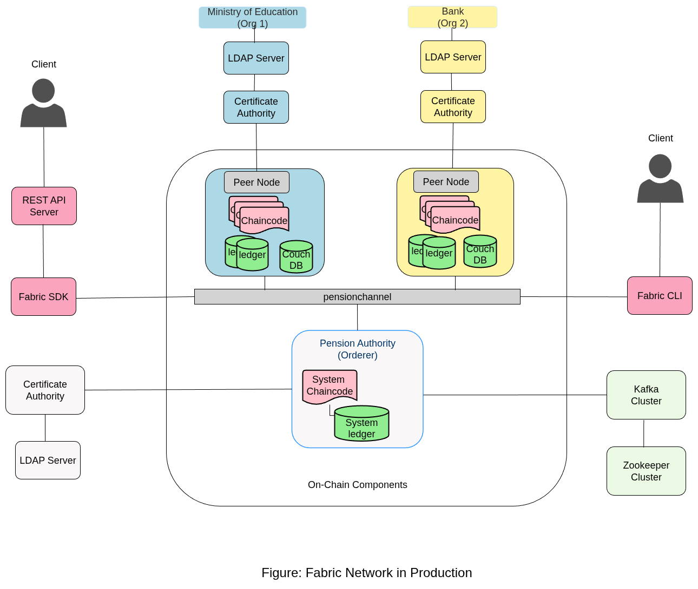
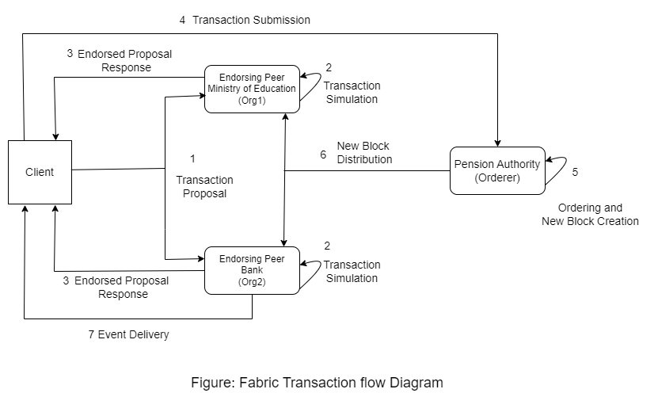
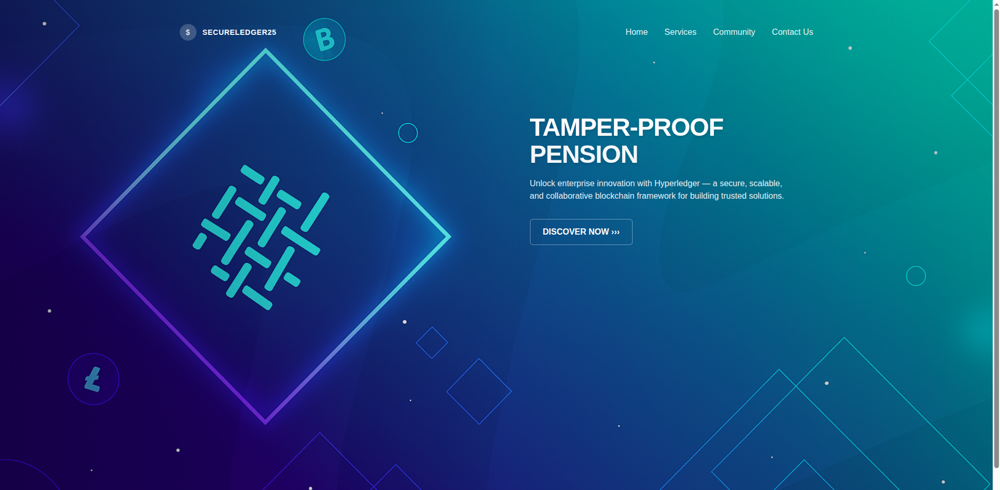
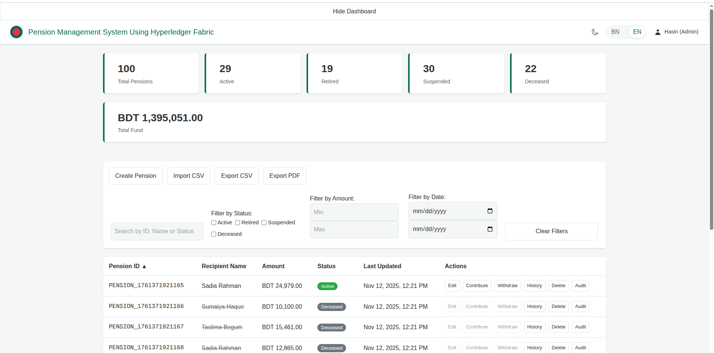
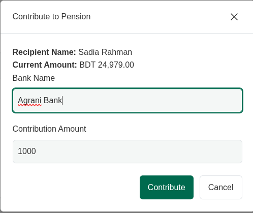
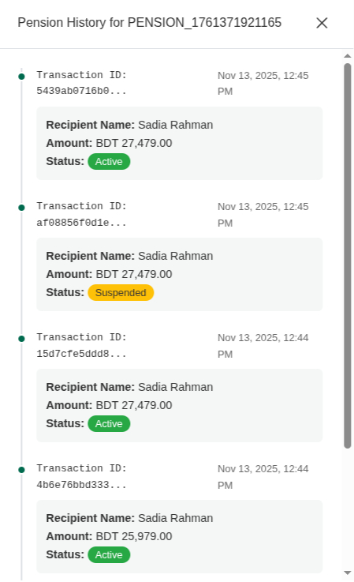
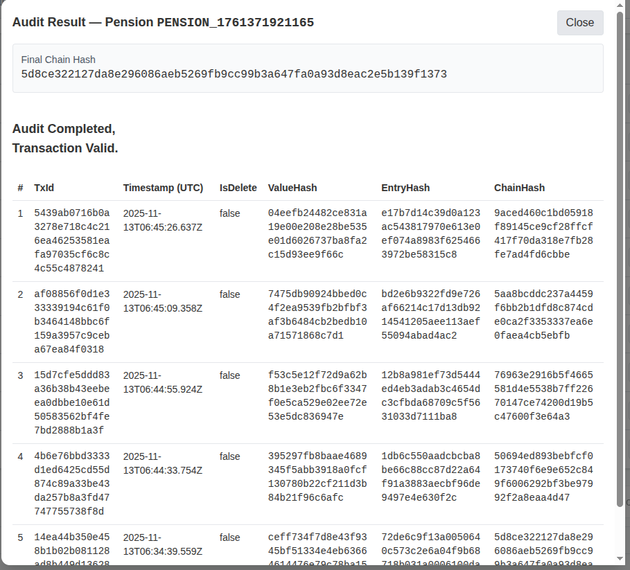
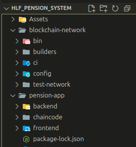

# Tamper-Proof and Auto-Auditable Pension Management System using Hyperledger Fabric

**Pension-App** is a blockchain-based pension management system built on **Hyperledger Fabric**.
It ensures **trust, transparency, and accountability** in pension disbursement by leveraging the **immutable ledger** and **permissioned network** of Fabric.

The system automates pension processing, prevents fraud, and provides **auto-auditable** transaction records — a modern approach to secure financial governance.

---

## Features

* **Immutable Ledger:** Every pension transaction is securely recorded on the blockchain.
* **Multi-Organization Network:** Includes Government, Bank, and Auditor organizations.
* **Smart Contract (Chaincode):** Automates pension approval and disbursement processes.
* **Auto-Audit Trails:** Each transaction is logged for transparency and verification.
* **Identity-Based Access Control:** Managed using Fabric CA.
* **Dashboard for Pensioners & Admins:** View, approve, and track pension disbursements.
* **Error Recovery & Transaction Validation:** Built-in endorsement and ordering mechanisms.
* **Fabric SDK Integration:** Backend built using Node.js SDK for network communication.

---

## Tech Stack

| **Component**              | **Technology Used**                   |
| -------------------------- | ------------------------------------- |
| Blockchain Framework       | Hyperledger Fabric v2.5               |
| Smart Contract (Chaincode) | Go                          |
| Backend (API Layer)        | Express.js with Fabric SDK               |
| Frontend (Dashboard)       | React.js and Tailwind CSS   |
| Network Setup              | Docker Compose / Kubernetes           |
| Certificate Authority      | Fabric CA                             |
| Channel Configuration      | `configtx.yaml`, `crypto-config.yaml` |
| Authentication             | Fabric MSP & Wallet System            |

---
## Architecture Diagrams

<p align="center">
  
  
  
</p>

## Screenshots
<p align="center">
  
  
  
  
  
  
</p>


## Project Structure

---

## System Setup Guide

This guide provides a clean sequence of commands to initialize a fresh Linux environment, remove old versions of tools, and install updated versions of essential development utilities such as Docker, Node.js, Go, jq, and curl.

---

### 1. System Update (Always Start Clean)

```bash
sudo apt update && sudo apt upgrade -y
sudo apt install -y ca-certificates gnupg lsb-release
```

---

### 2. Install `curl`

### Uninstall curl

```bash
sudo apt remove --purge -y curl
sudo apt autoremove -y
```

### Install curl

```bash
sudo apt install -y curl
curl --version   # Expect version: 8.5.0
```

---

### 3. Docker Installation

#### Uninstall Docker (if previously installed)

```bash
sudo apt remove -y docker docker.io containerd containerd.io
sudo apt autoremove -y
```

#### Install Docker

```bash
curl -fsSL https://get.docker.com | sudo bash
docker --version
docker compose version
```

#### Grant Docker permissions

```bash
sudo usermod -aG docker $USER
newgrp docker
```

#### Test Docker

```bash
docker ps
docker run hello-world
```

---

### 4. Install `jq`

#### Uninstall jq

```bash
sudo apt remove --purge -y jq
sudo apt autoremove -y
sudo rm -f /usr/local/bin/jq
```

#### Install jq

```bash
sudo apt install -y jq
jq --version
```

---

### 5. Install Go

#### Uninstall Go

```bash
which go
sudo rm -rf /usr/local/go
sudo rm -rf ~/go
sudo apt remove --purge -y golang-go
sudo apt autoremove -y
```

#### Install Go

```bash
sudo apt install -y golang-go
go version
```

---

### 6. Install Node.js

#### Uninstall Node.js

```bash
sudo apt remove --purge -y nodejs npm
sudo apt autoremove -y

nvm uninstall node
rm -rf ~/.nvm

# If installed manually
sudo rm -f /usr/local/bin/node
sudo rm -f /usr/local/bin/npm
sudo rm -f /usr/local/bin/npx
```

#### Install Node.js (LTS)

```bash
curl -fsSL https://deb.nodesource.com/setup_lts.x | sudo -E bash -
sudo apt install -y nodejs
```

---

### 7. Optional Cleanup

```bash
sudo apt autoremove -y
sudo apt clean
sudo apt autoclean
```

---

### Your system is now clean and fully configured!

---
## Running Steps

```bash

git clone https://github.com/Hasin20108/HLF-Pension-System.git
cd blockchain-network
export PATH=$PATH:$PWD/bin
peer version


step 1:
In directory
HLF-Pension-System/blockchain-network/test-network

./network.sh down
./network.sh up createChannel -ca -c pensionchannel
./network.sh deployCCAAS -c pensionchannel -ccn pension -ccp ../../pension-app/chaincode -ccl go

step 2:
In directory
HLF-Pension-System/pension-app/backend

# Delete Wallet folder (It's important)

# skip next three line if you are not running this project for the first time. 
npm install 
npm install express
npm install cors

node enrollAdmin.js 
node registerUser.js 
node server.js 


step 3:
In directory
HLF-Pension-System/pension-app/frontend

# skip next one line if you are not running this project for the first time. 
npm install

npm run dev

```
---

## Security Highlights

* MSP-based access control for each organization
* Encrypted identity and key storage in wallet
* Channel-based data privacy
* Audit-ready immutable records

---

## Future Enhancements

* Integration with national pension databases
* Support for biometric identity verification
* Analytics dashboard using Hyperledger Explorer
* Role-based web portal for each organization
* Integration with government payment APIs

---


## Deployment

For production or government use cases, deploy on **Kubernetes** with persistent storage:

```bash
kubectl apply -f k8s/
```

---

## Contributors

| Name               | Role                     | Contribution                           |
| ------------------ | ------------------------ | -------------------------------------- |
| Md. Bakhtiar Hasin | Blockchain Developer           | Network setup, chaincode logic development |
| Md. Abu Bokkor Siddik        | Web Developer | Backend, Frontend and Fabric SDK   |

---

## License

This project is licensed under the [Apache 2.0 License](LICENSE).

---

## Contact

**Md. Bakhtiar Hasin**

CSE Student | Blockchain Developer
[[hasin.ru.cse@gmail.com](hasin.ru.cse@gmail.com)]

---
